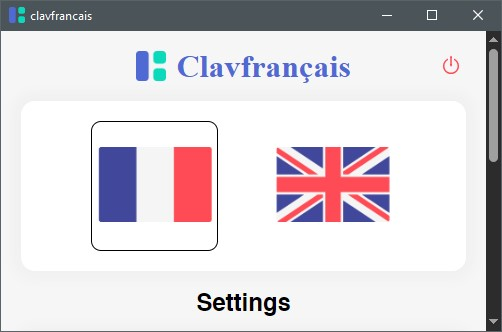

# **Clavfrançais**

### *A french typing tools for  qwert keyboard*

## How to use

- **L'accent aigu: type a vowel followed by w**
    - ew -> é
- **L'accent grave: type a vowel followed by f**
    - ef -> è
- **L'accent circonflexe: type a vowel twice**
    - ee -> ê
- **Le tréma: type a vowel followed by x**
    - ex -> ë
- **La cédille: type c twice**
    - cc -> ç
- **" -> »**
- **" -> «**
- **ae -> æ**
- **oe -> œ**
- **To revert a combination type the last character twice**
    - éw -> ew
    - èf -> ef
    - êe -> ê
    - ëx -> ex
    - çc -> c
    - æe -> ae
    - œe -> oe

